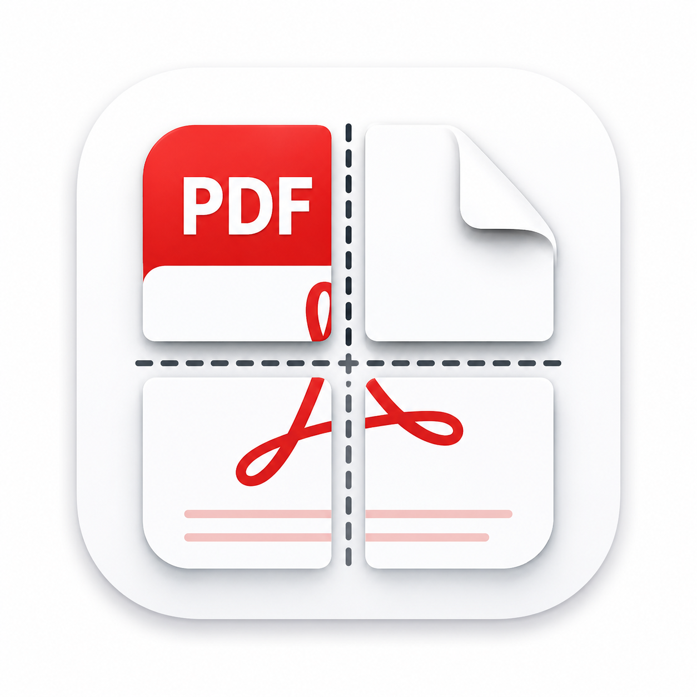

<h1>
  
  PaperSlice — PDF Poster Splitter
</h1>

将大型 PDF 页面（A0/A1/A2/A3 等）智能切分为可打印的标准纸张（A4/Letter 等），支持交互式分割线、手动排序、批量导出。

A desktop tool for splitting large PDF pages into printable tiles with interactive split-line placement, manual tile ordering, and batch export.

---

## 功能特性

| 功能 | 说明 |
|------|------|
| 交互式切割线 | 垂直/水平/四等分预设 + 手动添加 + 鼠标拖拽微调 |
| 手动排序 | 点击预览图块自定义输出顺序 |
| 页面缓存 | 切换页面自动保存/恢复每页的分割线和排序状态 |
| 项目存档 | `.ppslc` 格式保存所有页面配置，关闭时提示保存 |
| 批量导出 | 单页导出 + 全部页面合并导出为单个 PDF |
| 实时预览 | 1.5x 缩放渲染，分割线和图块顺序即时可见 |
| 图片导入 | 支持 PNG/JPG/BMP/TIFF 作为单页文档导入 |
| 裁切线 & 页码 | 导出时可叠加裁切线和页码标记 |
| 多纸张支持 | ISO216 (A0-A10, B0-B10) + ANSI + North American (Letter/Legal/Tabloid) |

---

## 操作流程

```
1. 打开或拖拽                        [文件] 菜单 或 [拖拽 PDF/图片到预览框]
   │
2. 选择目标纸张                [类别] + [大小] 下拉框
   │
3. 放置分割线
   ├─ 预设:   垂直二分 / 水平二分 / 四等分
   ├─ 手动:   + 竖线 / + 横线
   ├─ 拖拽:   鼠标拖动切割线微调
   └─ 清除:   清除所有切割线
   │
4. 选择排序方式                [ ] 自动顺序 (从左到右, 从上到下)
   │                            [√] 手动点击预览图块标记顺序
5. 导出
   ├─ 导出当前页  →  弹出保存对话框  →  输出 PDF
   └─ 切分并导出  →  批量导出所有已配置页面到单个 PDF
```


---

## 技术架构

**Clean Architecture + MVVM + DDD** 分层设计：

```
┌──────────────────────────────────────────────────┐
│  Presentation (PySide6)                           │
│  MainWindow ←→ MainViewModel (Qt Signal 桥接)     │
│  PreviewWidget (QGraphicsView, 拖拽/点击交互)      │
├──────────────────────────────────────────────────┤
│  Application (无 Qt/PyMuPDF 依赖)                  │
│  UseCases / DTOs / Repository Interfaces          │
├──────────────────────────────────────────────────┤
│  Domain (无任何外部依赖)                             │
│  Geometry → Paper → Document → Layout → Export    │
├──────────────────────────────────────────────────┤
│  Infrastructure                                   │
│  MuPDFRepository / PdfSplitter / ConfigService    │
└──────────────────────────────────────────────────┘
```

调用链：`GUI → ViewModel → UseCase → Repository Interface → MuPDF Adapter → PyMuPDF`

---

## 编译与运行

### 环境要求

- Python >= 3.10
- Windows / macOS / Linux

### 安装

```bash
git clone https://github.com/Eason3Blue/PaperSlice.git
cd PaperSlice
python -m venv .venv

# Windows
.venv\Scripts\activate
# macOS / Linux
source .venv/bin/activate

pip install -r requirements.txt
```

### 运行

```bash
# 普通模式
python -m pdfsplitter.main

# 开发模式 (启用 DEBUG 日志)
# PowerShell:
$env:pdfsplitter_DEV = "1"
python -m pdfsplitter.main
# CMD:
set pdfsplitter_DEV=1 && python -m pdfsplitter.main
```

### 测试

```bash
pytest tests/ -v

# 按模块运行
pytest tests/domain/geometry/ -v
pytest tests/domain/layout/ -v

# 覆盖率
pytest tests/ --cov=pdfsplitter --cov-report=html
```

### 打包为 exe

```bash
pip install pyinstaller
python build.py              # 构建
python build.py --clean      # 清理后构建
```

产物位于 `dist/PaperSlice/PaperSlice.exe`。图标：`resources/icon/icon.ico`。

### 依赖

| 包 | 版本 | 用途 |
|----|------|------|
| PySide6 | >=6.5.0 | GUI 框架 |
| PyMuPDF | >=1.24.0 | PDF 渲染与操作 |
| pypdf | >=4.0.0 | PDF 元数据处理 |
| rich | >=13.0.0 | 终端日志美化 |
| pytest | >=8.0.0 | 单元测试 |

---

## 项目结构

```
PaperSlice/
├── pdfsplitter/
│   ├── domain/            # 领域层: geometry, paper, layout, document, export
│   ├── application/       # 应用层: DTOs, UseCases, Repository 接口
│   ├── infrastructure/    # 基础设施: MuPDF, fitz, config, logging
│   ├── presentation/      # 表示层: MainWindow, ViewModel, PreviewWidget
│   ├── bootstrap.py       # DI 组合根
│   └── main.py            # 入口点
├── tests/                 # 单元测试 (292 条)
├── resources/             # 图标 & 图片
├── AGENTS.md              # AI Agent 开发指引
├── build.py               # PyInstaller 打包脚本
└── requirements.txt
```

---

## 配置

`settings.json`（自动创建于运行目录）：

```json
{
  "version": 1,
  "recent_files": [],
  "last_paper": "A4",
  "last_paper_category": "ISO216",
  "last_margin_mm": 10.0,
  "last_overlap_mm": 5.0,
  "cut_lines_enabled": false,
  "page_numbers_enabled": false,
  "default_dpi": 150
}
```

---

## 路线图

| 功能 | 状态 |
|------|------|
| 交互式切割线 + 手动排序 + 批量导出 | ✅ |
| 裁切线 / 页码 导出选项 | ✅ |
| 图片导入 (PNG/JPG/BMP/TIFF) | ✅ |
| Overlap (重叠) 支持 | 🔜 |
| 图片导出 (PNG/JPEG) | 📋 |
| CLI 命令行模式 | 📋 |
| 插件系统 | 📋 |
| Crop / Merge / Booklet / N-Up | 📋 |

---

## 许可证

GPL v3.0 License
