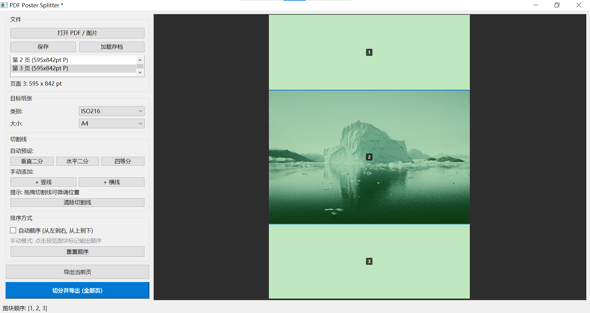

# PaperSlice — PDF Poster Splitter

将大型 PDF 页面（A0/A1/A2/A3 等）智能切分为可打印的标准纸张（A4/Letter 等），支持交互式分割线、手动排序、批量导出。

A desktop tool for splitting large PDF pages into printable tiles with interactive split-line placement, manual tile ordering, and batch export.

---

## 目录

- [功能特性](#功能特性)
- [操作流程](#操作流程)
- [技术架构](#技术架构)
- [编译与运行](#编译与运行)
- [项目结构](#项目结构)
- [编码规范](#编码规范)
- [测试](#测试)
- [配置](#配置)
- [路线图](#路线图)
- [许可证](#许可证)

---

## 功能特性

| 功能 | 说明 |
|------|------|
| 交互式切割线 | 垂直/水平/四等分预设 + 手动添加 + 鼠标拖拽微调 |
| 手动排序 | 点击预览图块自定义输出顺序 |
| 页面缓存 | 切换页面自动保存/恢复每页的分割线和排序状态 |
| 项目存档 | `.ppslc` 格式保存所有页面配置，关闭时提示保存 |
| 单页导出 | 导出当前页到目标纸张 |
| 全部页导出 | 批量导出所有已配置页面到单个 PDF |
| 实时预览 | 1.5x 缩放渲染，分割线和图块顺序即时可见 |
| 多纸张支持 | ISO216 (A0-A10, B0-B10) + ANSI + North American (Letter/Legal/Tabloid) |

---

## 操作流程

```
1. 打开 PDF                          [打开 PDF / 图片]
   │
2. 选择目标纸张                        [类别] + [大小] 下拉框
   │
3. 放置分割线
   ├─ 预设: 垂直二分 / 水平二分 / 四等分
   ├─ 手动: + 竖线 / + 横线
   ├─ 拖拽: 鼠标拖动切割线微调
   └─ 清除: 清除切割线
   │
4. 选择排序方式                        [√] 自动顺序 (从左到右, 从上到下)
   │                                    [ ] 手动点击预览图块标记顺序
5. 导出
   ├─ 导出当前页 → 弹出保存对话框 → 输出 PDF
   └─ 切分并导出 (全部页) → 批量导出所有已配置页面
```

**交互示例图**：



---

## 技术架构

采用 **Clean Architecture + MVVM + DDD** 分层设计：

```
┌──────────────────────────────────────────────────┐
│  Presentation (PySide6)                           │
│  MainWindow ←→ MainViewModel (Qt Signal 桥接)     │
│  PreviewWidget (QGraphicsView, 拖拽/点击交互)      │
│  不包含任何 PDF 操作                                │
├──────────────────────────────────────────────────┤
│  Application (无 Qt/PyMuPDF 依赖)                  │
│  LoadDocumentUseCase / PosterSplitUseCase          │
│  ExportUseCase / DTOs / Pipeline / Repository API │
├──────────────────────────────────────────────────┤
│  Domain (无任何外部依赖)                             │
│  Geometry → Units → Paper → Document → Layout     │
│  → Export → Event                                  │
├──────────────────────────────────────────────────┤
│  Infrastructure                                   │
│  MuPDFRepository / PdfSplitter / ConfigService    │
└──────────────────────────────────────────────────┘
```

**调用链**：`GUI → ViewModel → UseCase → Repository Interface → MuPDF Adapter → PyMuPDF`

**核心设计模式**：

| 模式 | 应用位置 |
|------|---------|
| MVVM | `presentation/main_viewmodel.py` ↔ `main_window.py` |
| Repository | `application/repository.py` → `infrastructure/mupdf_repository.py` |
| Strategy | `domain/export/export_config.py` (PDF Single / Multiple) |
| Pipeline | `application/pipeline.py` |
| Event Bus | `domain/event/event_bus.py` (独立于 Qt Signal) |
| Dependency Injection | `bootstrap.py` |

---

## 编译与运行

### 环境要求

- Python >= 3.10
- Windows / macOS / Linux

### 安装

```bash
git clone https://github.com/Eason3Blue/PaperSlice.git
cd PaperSlice
python -m venv .venv
source .venv/bin/activate   # Linux/macOS
# 或
.venv\Scripts\activate      # Windows

pip install -r requirements.txt
```

### 运行

```bash
# 模块方式 (推荐)
python -m pdfsplitter.main

# 或直接脚本方式
python pdfsplitter/main.py

# 开发模式 (启用 DEBUG 日志)
# Windows PowerShell:
$env:PAPERSLICE_DEV = \"1\"
python -m pdfsplitter.main
```

### 运行测试

```bash
pytest tests/ -v
```

### 打包为 exe

使用 PyInstaller 打包为单文件 Windows 可执行程序：

```bash
pip install pyinstaller
python build.py
```

产物位于 `dist/PaperSlice.exe`。图标取自 `resources/icon/icon.ico`。

如需清理上次构建缓存:

```bash
python build.py --clean
```

### 依赖

```
PySide6>=6.5.0    # GUI 框架
PyMuPDF>=1.24.0   # PDF 渲染与操作
pypdf>=4.0.0      # PDF 元数据处理
rich>=13.0.0      # 终端日志美化
pytest>=8.0.0     # 单元测试
```

---

## 项目结构

```
PaperSlice/
├── pdfsplitter/                    # 主包
│   ├── __init__.py
│   ├── bootstrap.py                # DI 装配器 (App)
│   ├── main.py                     # 入口点
│   │
│   ├── domain/                     # 领域层 (零外部依赖)
│   │   ├── geometry/               # 几何核心 (Rect, Point, Size, Margin, Transform)
│   │   ├── units/                  # 物理单位 (Length: mm/pt/inch/pixel)
│   │   ├── paper/                  # 纸张系统 (PaperSpec, PaperDatabase)
│   │   ├── document/               # 文档抽象 (Document, Page)
│   │   ├── layout/                 # 网格/图块/布局引擎/切割线/排序
│   │   ├── event/                  # 事件总线
│   │   └── export/                 # 导出配置 (ExportConfig, ExportResult)
│   │
│   ├── application/                # 应用层 (无 Qt/PyMuPDF)
│   │   ├── dto.py                  # 数据传输对象
│   │   ├── repository.py           # 仓库抽象接口
│   │   ├── usecases.py             # 加载/切分用例
│   │   ├── export_usecase.py       # 导出用例
│   │   └── pipeline.py             # 处理管线框架
│   │
│   ├── infrastructure/             # 基础设施层
│   │   ├── mupdf_repository.py     # MuPDF 文档仓库
│   │   ├── pdf_splitter.py         # PDF 切分服务
│   │   ├── config.py               # 配置服务 (settings.json)
│   │   └── logging_config.py       # 统一日志配置
│   │
│   ├── presentation/               # 表示层 (仅 GUI)
│   │   ├── main_viewmodel.py       # 主 ViewModel
│   │   ├── main_window.py          # 主窗口
│   │   └── preview_widget.py       # 交互式预览组件
│   │
│   └── plugins/                    # 未来插件 (待实现)
│
├── tests/                          # 单元测试 (267+, 100% pass)
│   ├── domain/
│   │   ├── geometry/               # 104 tests
│   │   ├── units/                  # 35 tests
│   │   ├── paper/                  # 27 tests
│   │   ├── document/               # 21 tests
│   │   ├── layout/                 # 55 tests
│   │   ├── event/                  # 8 tests
│   │   └── export/                 # 5 tests
│   ├── application/                # 7 tests
│   └── infrastructure/             # 5 tests
│
├── .config/opencode/AGENTS.md      # 开发规范
├── requirements.txt
├── LICENSE
└── README.md
```

---

## 编码规范

### Import 顺序

```
标准库 → 第三方库 → 本地模块
每组间空行分隔，组内字母序排列
```

```python
import os
import sys
from pathlib import Path

import numpy as np
from PySide6.QtCore import Qt, Signal

from pdfsplitter.domain.geometry import Rect, Point
from pdfsplitter.application.dto import DocumentDTO
```

### 命名规范 (PEP 8)

| 类型 | 规范 | 示例 |
|------|------|------|
| 模块名 | 小写 + 下划线 | `layout_engine.py` |
| 类名 | 大驼峰 | `PosterSplitUseCase` |
| 函数/方法 | 小写 + 下划线 | `calculate_layout()` |
| 变量 | 小写 + 下划线 | `page_count` |
| 常量 | 大写 + 下划线 | `MM_PER_INCH` |
| 私有 | 单下划线前缀 | `_page_states` |
| Qt 信号 | 小写 + 下划线 + `_signal` | `document_loaded_signal` |

### Docstring (Google Style)

```python
def calculate_layout(self, page: Page, target_size: Size) -> Grid:
    """根据页面和目标纸张计算切分网格.

    Args:
        page: 源页面领域对象.
        target_size: 目标纸张尺寸.

    Returns:
        包含所有切分图块的 Grid 实例.

    Raises:
        ValueError: 参数无效时抛出.
    """
```

### Dataclass 规范

- 纯数据容器，不含业务逻辑
- 不可变对象使用 `frozen=True`
- 字段带类型注解
- 可变默认值使用 `field(default_factory=list)`

```python
from dataclasses import dataclass

@dataclass(frozen=True)
class Point:
    x: float
    y: float
```

### 分层约束

| 层 | 允许依赖 | 禁止依赖 |
|----|---------|---------|
| Domain | 标准库 | Qt, PyMuPDF, pypdf |
| Application | Domain | Qt, PyMuPDF |
| Infrastructure | Domain, Application | Qt (日志除外) |
| Presentation | Application, Domain (via DTO) | PyMuPDF, 直接领域对象 |

---

## 测试

```bash
# 全部测试
pytest tests/ -v

# 按模块
pytest tests/domain/geometry/ -v
pytest tests/domain/layout/ -v

# 覆盖率
pytest tests/ --cov=pdfsplitter --cov-report=html
```

**测试规范**：
- 文件命名 `test_<模块名>.py`
- 函数命名 `test_<功能描述>.py`
- 使用 `@pytest.mark.parametrize` 参数化
- 每个测试独立，不依赖执行顺序
- Domain 层 Geometry/Paper/Layout 要求 100% 覆盖

---

## 配置

程序通过 `settings.json` 管理用户偏好（自动创建于运行目录）：

```json
{
  "version": 1,
  "recent_files": [],
  "last_paper": "A4",
  "last_paper_category": "ISO216",
  "last_margin_mm": 10.0,
  "last_overlap_mm": 5.0,
  "cut_lines_enabled": false,
  "page_numbers_enabled": false,
  "default_dpi": 150
}
```

---

## 路线图

| 阶段 | 功能 | 状态 |
|------|------|------|
| v0.1 | 交互式切割线 + 手动排序 + 单页/全部页导出 | ✅ 已完成 |
| v0.2 | 裁切线 / 页码 导出选项 | ✅ 已实现 |
| v0.3 | Overlap (重叠) 支持 | 🔜 计划中 |
| v0.4 | 图片导入 (PNG/JPG) | 🔜 计划中 |
| v0.5 | 图片导出 (PNG/JPEG) | 🔜 计划中 |
| v1.0 | CLI 命令行模式 | 📋 规划中 |
| v1.1 | 插件系统 | 📋 规划中 |
| v2.0 | Crop / Merge / Booklet / N-Up | 📋 规划中 |

---

## 许可证

GPL v3.0 License
